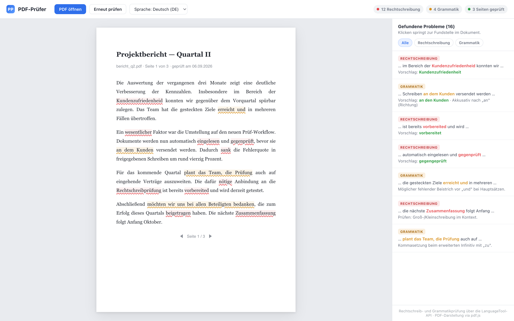

# PDF-Prüfer

Ein Browser-Werkzeug zur Rechtschreib- und Grammatikprüfung deutscher
PDF-Dokumente. Man öffnet ein PDF, der Text wird Seite für Seite ausgelesen und
geprüft, Fundstellen werden direkt im Dokument markiert und in einer Seitenleiste
mit Korrekturvorschlägen aufgelistet.

Dies ist ein **Showcase-Repo** — Projektvorstellung mit UI-Vorschau, **kein
Quellcode**.

## Funktionen

- PDF-Anzeige direkt im Browser (pdf.js) — kein Upload auf einen Server nötig
- Textextraktion pro Seite
- Rechtschreib- und Grammatikprüfung über die **LanguageTool-API**
- Markierung direkt im Dokument: rot = Rechtschreibung, gelb = Grammatik
- Seitenleiste mit Fundstelle, Kontext und Korrekturvorschlag
- Auswahl der Sprachvariante (DE / AT / CH)
- Filter nach Fehlerart

## Technik

- Vanilla JavaScript, kein Framework
- **pdf.js** für Darstellung und Textextraktion
- **LanguageTool-API** für die sprachliche Prüfung

## UI-Vorschau

*Designentwurf der Oberfläche — nicht die laufende Anwendung.*

---

Persönliches Projekt.
